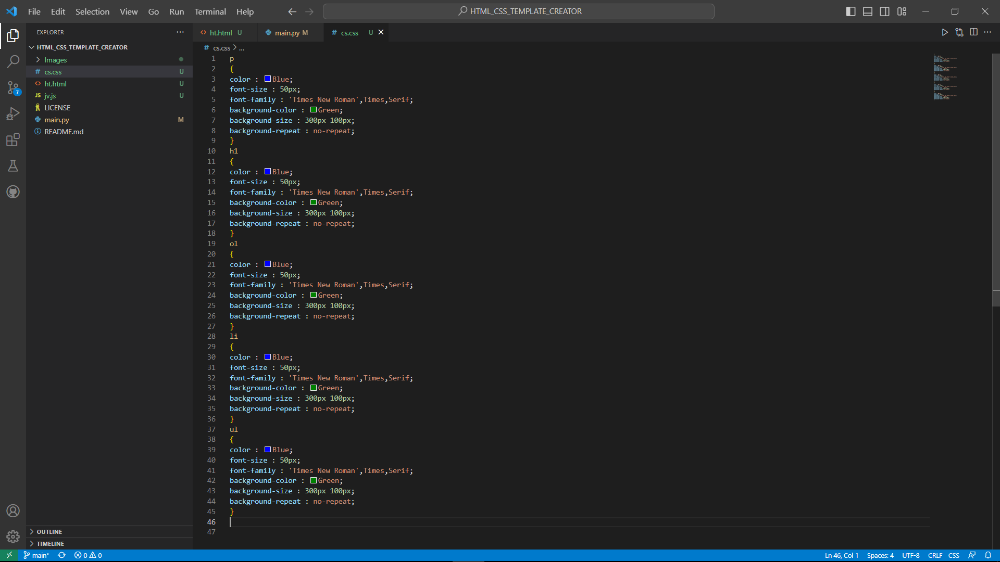

<!--  -->
<kbd></kbd>

# HTML_CSS_TEMPLATE_CREATOR
THIS IS A PYTHON CODE WHICH IS DESIGNED TO PROVIDE A HTML_CSS TEMPLATE, AS PER USER'S REQUIREMENTS.

## Usage

- Open any editor like  VISUAL STUDIO CODE, run the above python code.

## Examples

- 1st Step : <!--  -->
            <kbd></kbd>
            
- Output HTML FILE : <!--  -->
            <kbd></kbd>

- Output CSS FILE: <!--  -->
            <kbd></kbd>
            
            **NOTE : JAVASCRIPT FILE WILL REMAIN BLANK , HTML AND CSS FILE WILL BE IN THE SAME LOCATION WHERE THE *main.py* FILE IS RUNNING.**
 
 
## License

[MIT](https://choosealicense.com/licenses/mit/)

## Authors

- [@Manmay Chakraborty](https://www.github.com/manmay2)

## 🚀 About Me
Hi, I am Manmay Chakraborty who is currently learning C language in this very repository.
## Feedback

If you have any feedback, feel free to reach out at manmaycoder@gmail.com

## 🛠 Skills
Javascript, HTML, CSS,C,C++,PYTHON,JAVA and SQL.
